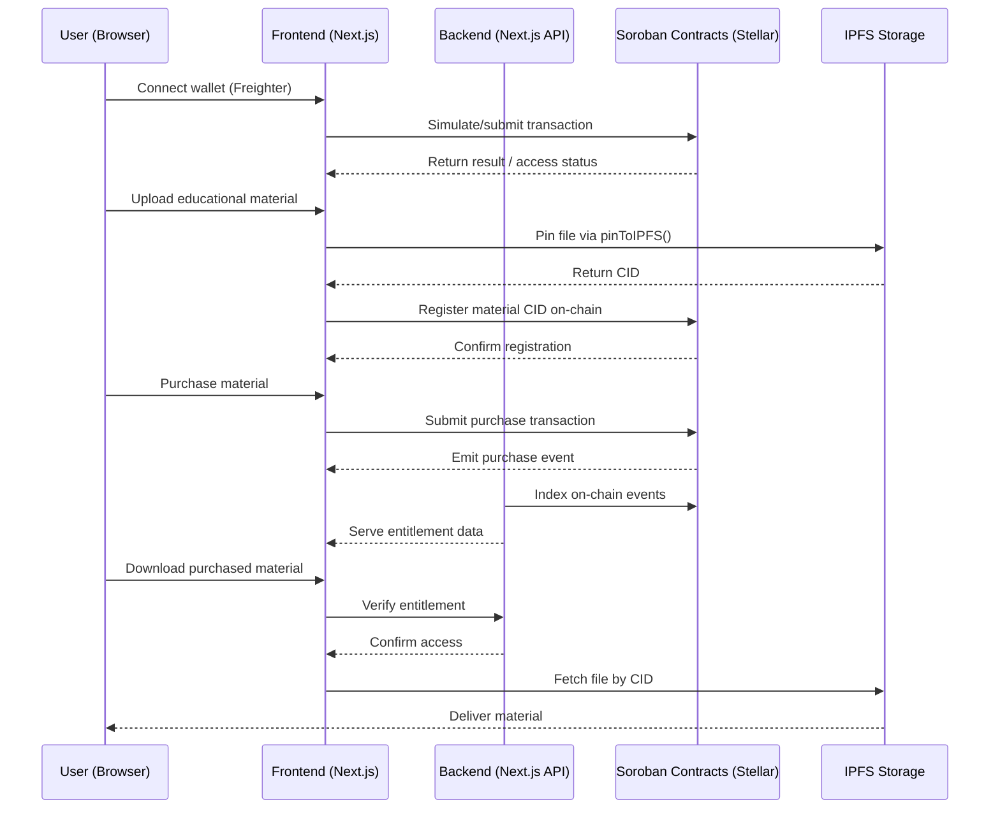

# Stellar Integration Guide

## 1. Architecture Overview

EduVault has transitioned to a native Stellar/Soroban architecture.

- **Frontend:** Next.js with `@stellar/stellar-sdk`.
- **Contracts:** Soroban/Rust for on-chain logic.
- **Backend:** Next.js API for indexing.
- **Storage:** IPFS for educational materials.

### Interaction Diagram



## 2. Developer Environment Setup

### Prerequisites

- [Rust](https://www.rust-lang.org/tools/install) (stable toolchain)
- [Stellar CLI](https://developers.stellar.org/docs/tools/developer-tools/cli/install-stellar-cli) (`stellar` / `soroban` CLI)

### Step 1: Install the Soroban CLI

```bash
cargo install --locked stellar-cli --features opt
```

Verify the installation:

```bash
stellar --version
```

### Step 2: Start a Local RPC Node (Optional — for offline development)

Use the Stellar Quickstart Docker image to run a local network with a built-in RPC endpoint:

```bash
docker run --rm -it \
  -p 8000:8000 \
  --name stellar \
  stellar/quickstart:latest \
  --local \
  --enable-soroban-rpc
```

The local RPC will be available at `http://localhost:8000/soroban/rpc`.

### Step 3: Network Configuration

Add the testnet (or point to your local node):

```bash
# Testnet
soroban network add \
  --rpc-url https://soroban-testnet.stellar.org:443 \
  --network-passphrase "Test SDF Network ; September 2015" \
  testnet

# Local node
soroban network add \
  --rpc-url http://localhost:8000/soroban/rpc \
  --network-passphrase "Standalone Network ; February 2017" \
  local
```

### Step 4: Create a Test Identity

```bash
soroban keys generate dev_user
```

Fund the account on testnet via Friendbot:

```bash
curl "https://friendbot.stellar.org?addr=$(soroban keys address dev_user)"
```

## 3. Integration Patterns

### A. Initializing the Stellar Connection

```js
import { Server } from '@stellar/stellar-sdk';

const server = new Server('https://soroban-testnet.stellar.org:443');
const networkPassphrase = 'Test SDF Network ; September 2015';
```

### B. Calling a Soroban Smart Contract

```js
import {
  Contract,
  Keypair,
  Networks,
  SorobanRpc,
  TransactionBuilder,
  BASE_FEE,
  xdr,
} from '@stellar/stellar-sdk';

const rpcServer = new SorobanRpc.Server('https://soroban-testnet.stellar.org:443');
const networkPassphrase = Networks.TESTNET;
const CONTRACT_ID = 'CC...';
const contract = new Contract(CONTRACT_ID);

async function checkAccess(callerPublicKey) {
  // Load the caller's account to get the current sequence number
  const account = await rpcServer.getAccount(callerPublicKey);

  // Wrap the operation in a fully constructed Transaction — simulateTransaction
  // requires a Transaction object, not a raw operation returned by contract.call()
  const tx = new TransactionBuilder(account, {
    fee: BASE_FEE,
    networkPassphrase,
  })
    .addOperation(
      contract.call(
        'has_access',
        xdr.ScVal.scvAddress(
          xdr.ScAddress.scAddressTypeAccount(
            xdr.AccountID.publicKeyTypeEd25519(
              Keypair.fromPublicKey(callerPublicKey).rawPublicKey()
            )
          )
        )
      )
    )
    .setTimeout(30)
    .build();

  const simulation = await rpcServer.simulateTransaction(tx);

  if (SorobanRpc.Api.isSimulationError(simulation)) {
    throw new Error(`Simulation failed: ${simulation.error}`);
  }

  const hasAccess = simulation.result?.retval?.value() ?? false;
  console.log('Access Status:', hasAccess);
  return hasAccess;
}
```

### C. Identity & Wallet Handling (Freighter)

```js
import { isConnected, getPublicKey } from '@stellar/freighter-api';

async function connectWallet() {
  if (await isConnected()) {
    const publicKey = await getPublicKey();
    return publicKey;
  }
}
```

```js
import { pinToIPFS } from '@/lib/ipfs';

// Example: Uploading a lesson note before saving the CID to Soroban
const cid = await pinToIPFS(fileData);
console.log('File pinned at:', cid);
```

### D. Backend Soroban Invocation (Next.js API Route)

Use this pattern in a Next.js API route to simulate or submit a Soroban contract call from server-side code. The backend signs with a funded keypair stored in environment variables — no browser wallet is involved.

```js
// src/app/api/entitlements/route.js
import {
  Keypair,
  Networks,
  TransactionBuilder,
  BASE_FEE,
  Contract,
  xdr,
  SorobanRpc,
} from '@stellar/stellar-sdk';

const RPC_URL = process.env.STELLAR_RPC_URL;
const CONTRACT_ID = process.env.SOROBAN_CONTRACT_ID;
const NETWORK_PASSPHRASE = process.env.STELLAR_NETWORK_PASSPHRASE ?? Networks.TESTNET;

// Funded backend keypair — store the secret in .env.local, never commit it
const serverKeypair = Keypair.fromSecret(process.env.STELLAR_SERVER_SECRET);

export async function GET(request) {
  const { searchParams } = new URL(request.url);
  const userPublicKey = searchParams.get('user');

  if (!userPublicKey) {
    return Response.json({ error: 'Missing user public key' }, { status: 400 });
  }

  try {
    const server = new SorobanRpc.Server(RPC_URL);
    const contract = new Contract(CONTRACT_ID);

    // Load the server account to get the current sequence number
    const account = await server.getAccount(serverKeypair.publicKey());

    // Build the transaction
    const tx = new TransactionBuilder(account, {
      fee: BASE_FEE,
      networkPassphrase: NETWORK_PASSPHRASE,
    })
      .addOperation(
        contract.call(
          'has_access',
          xdr.ScVal.scvAddress(
            xdr.ScAddress.scAddressTypeAccount(
              xdr.AccountID.publicKeyTypeEd25519(
                Keypair.fromPublicKey(userPublicKey).rawPublicKey()
              )
            )
          )
        )
      )
      .setTimeout(30)
      .build();

    // Simulate — no fee charged, no state change; safe for read-only checks
    const simulation = await server.simulateTransaction(tx);

    if (SorobanRpc.Api.isSimulationError(simulation)) {
      return Response.json({ error: simulation.error }, { status: 500 });
    }

    const hasAccess = simulation.result?.retval?.value() ?? false;
    return Response.json({ user: userPublicKey, hasAccess });
  } catch (err) {
    console.error('Soroban invocation failed:', err);
    return Response.json({ error: 'Contract call failed' }, { status: 500 });
  }
}
```

> **Submitting a state-changing transaction** (e.g. recording a purchase) follows the same pattern but requires an additional `prepareTransaction` + `sign` + `sendTransaction` step:
>
> ```js
> const preparedTx = await server.prepareTransaction(tx);
> preparedTx.sign(serverKeypair);
> const sendResult = await server.sendTransaction(preparedTx);
> ```

Required environment variables (add to `.env.local` and `.env.example`):

```
STELLAR_RPC_URL=https://soroban-testnet.stellar.org:443
STELLAR_NETWORK_PASSPHRASE=Test SDF Network ; September 2015
SOROBAN_CONTRACT_ID=CC...
STELLAR_SERVER_SECRET=S...   # Never commit — backend signing key only
```
